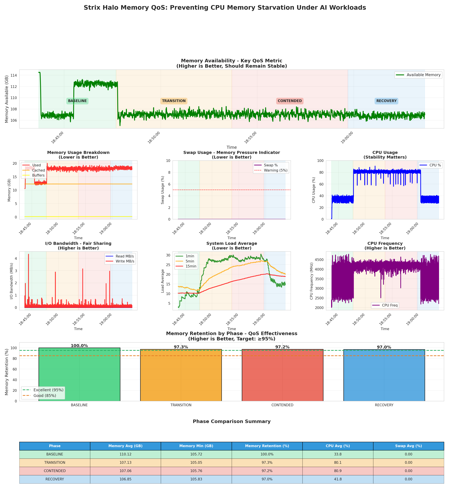

# Strix Halo Memory QoS Demonstration

A comprehensive demonstration showcasing Strix Halo's memory QoS (Quality of Service) capabilities in preventing CPU memory starvation under AI workloads.

## Overview

This demonstration shows how Strix Halo maintains system responsiveness and prevents CPU memory starvation when running intensive AI workloads alongside CPU-intensive tasks.

## Quick Start

### 1. Install Prerequisites

```bash
./scripts/install_prerequisites.sh
```

This installs Ollama, Python packages, CMake, and the required LLM model.

### 2. Run the Demo

```bash
./scripts/memory_qos_demo.sh --duration 600
```

This runs a 10-minute demonstration (600 seconds). Adjust the duration as needed.

### 3. Visualize Results

```bash
LATEST_CSV=$(ls -t logs/memory_qos_metrics_*.csv | head -1)
python3 scripts/visualize_memory_qos.py --metrics-file "$LATEST_CSV"
```

This generates a comprehensive visualization showing all metrics across the four phases.

### Sample Output

The visualization generates a comprehensive dashboard showing memory QoS effectiveness:



> **Note**: If the image doesn't display, copy your generated visualization from `logs/` to `docs/assets/sample_output.png` and commit it to the repository.

*Example visualization showing memory availability, retention, CPU usage, and other key metrics across all four phases. The image is generated in the `logs/` directory after running the visualization script.*

## What This Demo Shows

**Memory QoS Protection**: CPU stays responsive and memory availability is maintained even under heavy AI loads.

The demonstration runs through four phases:
1. **Baseline**: Memory-intensive workload only (CMake builds + Python memory operations)
2. **Transition**: Workload + LLM starting (QoS should activate immediately)
3. **Contended**: Both workloads fully active (QoS should maintain memory availability)
4. **Recovery**: LLM stopped, workload continues (system should recover gracefully)

## Understanding the Results

### Key Metrics

The demo measures and visualizes:

1. **Memory Availability** (Primary QoS Metric)
   - Target: Should remain stable throughout all phases
   - Higher is better
   - Demonstrates memory QoS protection

2. **Memory Retention by Phase**
   - Target: ≥95% (Excellent), ≥85% (Good)
   - Shows how much memory availability is retained compared to baseline
   - Higher is better

3. **Swap Usage**
   - Target: 0% (no swap usage indicates no memory pressure)
   - Lower is better
   - Zero swap usage is a strong indicator of effective QoS

4. **CPU Usage**
   - Shows CPU utilization across phases
   - Stability matters more than absolute percentage

5. **System Load Average**
   - Shows system load over 1, 5, and 15-minute windows
   - Lower is better
   - Demonstrates system responsiveness

6. **I/O Bandwidth**
   - Shows fair sharing of I/O resources
   - Higher is better

### What Makes Strix Halo Different

Strix Halo's memory QoS ensures that:
- CPU traffic gets guaranteed bandwidth allocation
- Memory latency floors are enforced for CPU access
- Foreground work remains interactive even under heavy AI load
- Memory availability is maintained (no starvation)

This is what enables the "always-on AI PC" experience - AI assistants that don't require you to turn them off when you're doing real work.

## Documentation

### Detailed Guides

- **[Memory QoS Demo Documentation](docs/MEMORY_QOS_DEMO.md)**: Complete guide to the demo, workloads, and metrics

### Installation

- **[Installation Guide](INSTALLATION.md)**: Detailed installation instructions

## Troubleshooting

### Common Issues

1. **Ollama not found**: Ensure Ollama is installed and in PATH
2. **Model not available**: Run `ollama pull codellama:7b` first
3. **Python packages missing**: Run `pip install -r requirements.txt`
4. **CMake not found**: Install build tools: `sudo apt-get install cmake build-essential`
5. **Project path not found**: Ensure `test-projects/json` exists or use `--project-path` to specify a different path

See [Troubleshooting Guide](docs/troubleshooting.md) for more details.

## Contributing

Contributions, issues, and feature requests are welcome! Feel free to check the existing issues or open a new one.

## Legal Notice

This demo shows absolute performance characteristics of the developer's Strix Halo hardware. All measurements are taken on Strix Halo systems only. This suite makes no direct comparisons or competitive claims.

## License

This project is licensed under the MIT License - see the [LICENSE](LICENSE) file for details.
